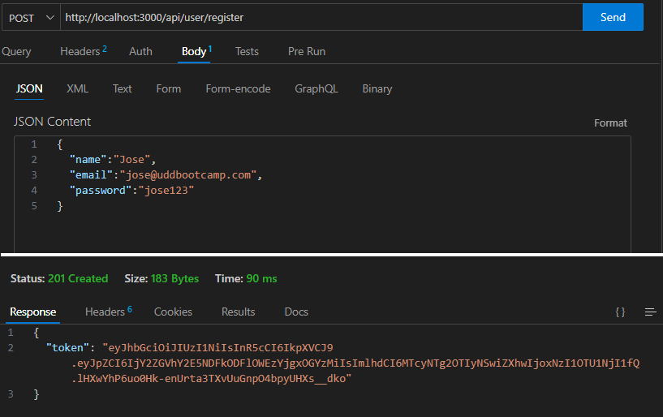
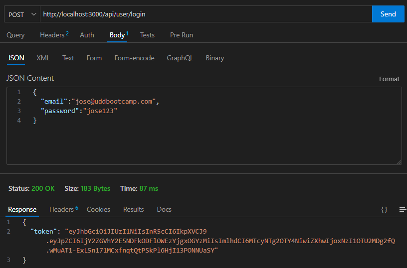
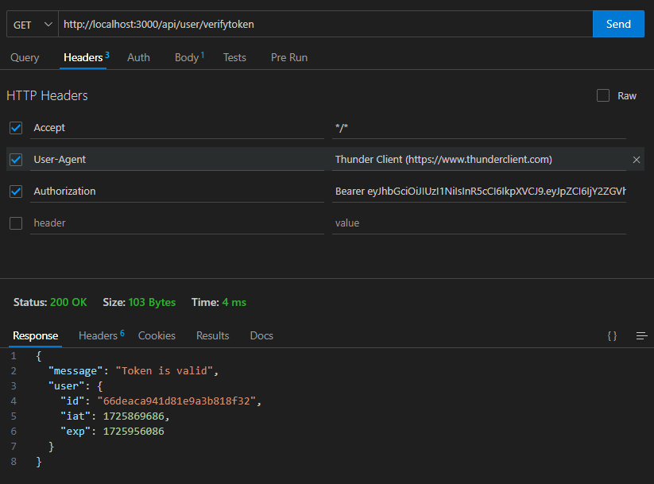
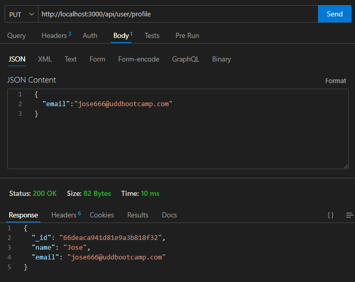
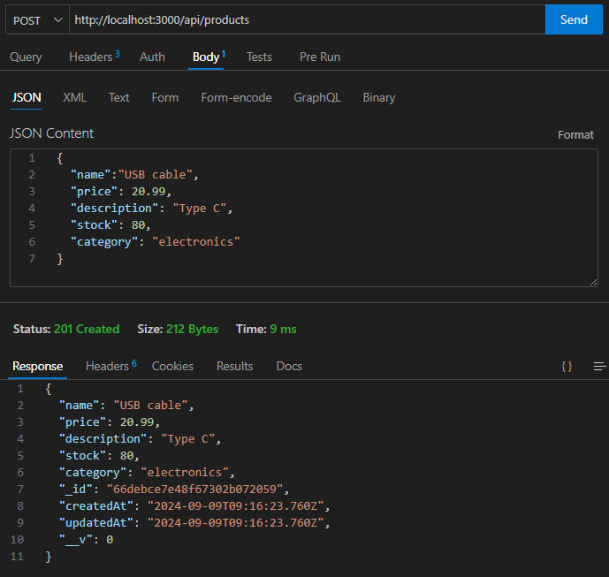
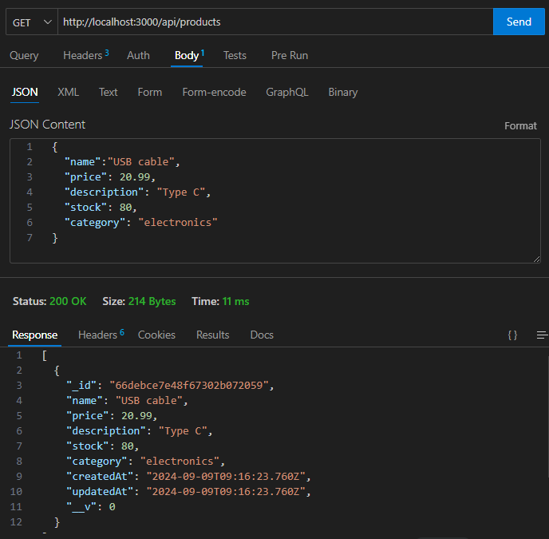
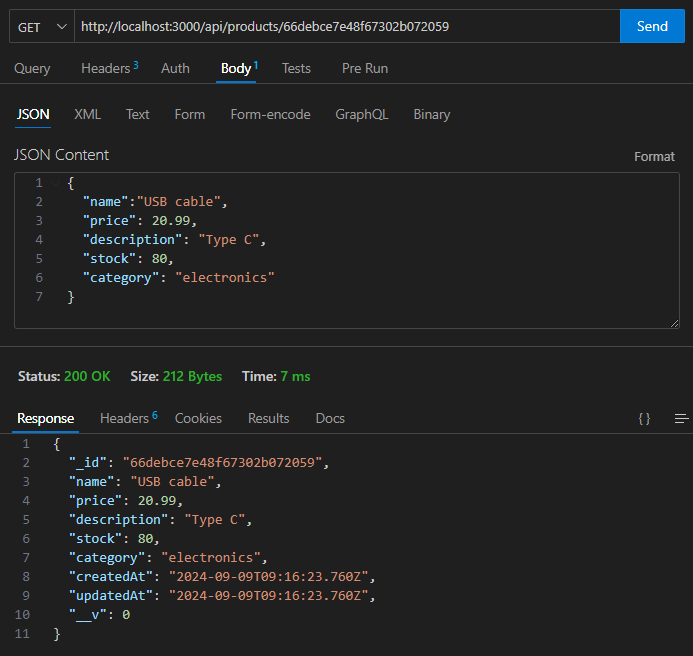
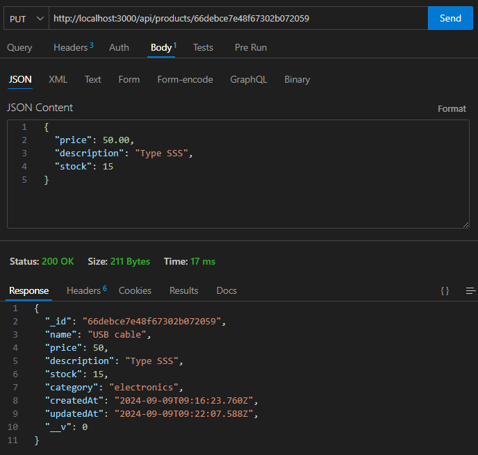
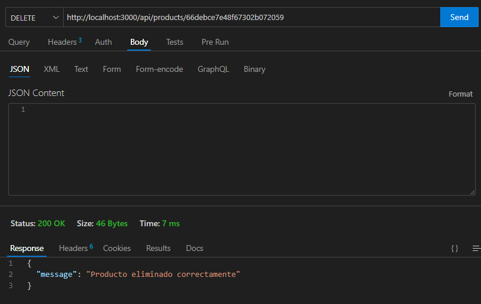

**\[UDD\] Desarrollo Web Fullstack C13**

# Proyecto 06: Aplicación Backend con Autenticación

- [Descripción](#descripci%C3%B3n)
- [Desarrollo](#desarrollo)
    - [Estructura de carpetas](#estructura-de-carpetas)
    - [productController.js](#productcontrollerjs)
    - [userController.js](#usercontrollerjs)
    - [authMiddleware.js](#authmiddlewarejs)
    - [productModel.js](#productmodeljs)
    - [userModel.js](#usermodeljs)
    - [productRoutes.js](#productroutesjs)
    - [userRoutes.js](#userroutesjs)
    - [server.js](#serverjs)
- [Pruebas](#pruebas)
    - [Endpoints para Usuario](#endpoints-para-usuario)
        - [Registrar un usuario](#registrar-un-usuario)
        - [Iniciar sesión de usuario](#iniciar-sesi%C3%B3n-de-usuario)
        - [Verificar el token del usuario](#verificar-el-token-del-usuario)
        - [Actualizar información del usuario](#actualizar-informaci%C3%B3n-del-usuario)
    - [Enpoints para Producto](#enpoints-para-producto)
        - [Crear un producto](#crear-un-producto)
        - [Leer todos los productos](#leer-todos-los-productos)
        - [Leer un producto específico](#leer-un-producto-espec%C3%ADfico)
        - [Actualizar un producto](#actualizar-un-producto)
        - [Eliminar un producto](#eliminar-un-producto)
- [Conclusión](#conclusi%C3%B3n)
- [Referencias](#referencias)

<!-- /TOC -->


## Descripción
El proyecto consiste en construir una aplicación backend que administre la autenticación y autorización de los usuarios.

Además, se utiliza MongoDB y Mongoose para la persistencia de datos. Se construye un modelo de "usuario" y un modelo de “producto”. Estos modelos están relacionados entre sí a través de MongoDB.

## Desarrollo

### Estructura de carpetas

```
Proyecto06
├─ controllers
│  ├─ productController.js
│  └─ userController.js
├─ middleware
   └─ authMiddleware.js
├─ models
│  ├─ productModel.js
│  └─ userModel.js
├─ routes
│  ├─ productRoutes.js
│  └─ userRoutes.js
├─ .env
├─ .gitignore
├─ README.md
└─ server.js
```

### `productController.js`
Contiene las funciones que manejan la lógica de los productos en la aplicación. 

- Obtener productos: Función para obtener todos los productos o un producto específico de la base de datos.
- Crear producto: Función para agregar un nuevo producto a la base de datos.
- Actualizar producto: Función para modificar un producto existente.
- Eliminar producto: Función para eliminar un producto de la base de datos.
- Buscar productos: Función para buscar productos con ciertos criterios o filtros.

### `userController.js`
Contiene las funciones relacionadas con la gestión de usuarios. Algunas de las funcionalidades más comunes incluyen:

- Registro de usuario: Función para registrar a nuevos usuarios en la aplicación.
- Inicio de sesión: Función para autenticar a un usuario, generalmente retornando un token JWT si las credenciales son correctas.
- Perfil de usuario: Función para obtener o actualizar el perfil del usuario autenticado.
- Autenticación y roles: Funciones adicionales para manejar la asignación de roles o permisos.

### `authMiddleware.js`
Implementa la lógica de autenticación para proteger las rutas de la API:

Características:

- Verificar el token JWT: Asegurarse de que las solicitudes que llegan a rutas protegidas incluyen un token JWT válido.
- Protección de rutas: Función middleware que se inserta en las rutas para verificar que el usuario esté autenticado antes de permitir el acceso a ciertas funcionalidades.
- Roles y permisos: A veces también maneja la lógica para verificar si el usuario tiene ciertos permisos o roles.

### `productModel.js`
Define el esquema de los productos en la base de datos. 

Características:

- Estructura del producto: Define las propiedades del producto, como nombre, precio, categoría, descripción, stock, etc.
- Validaciones: Define restricciones y validaciones para las propiedades del producto, como campos obligatorios o tipos de datos.
- Métodos: Métodos personalizados relacionados con el modelo de producto que se pueden usar en otras partes de la aplicación.

### `userModel.js`
Define el esquema de los usuarios en la base de datos. Algunas características clave incluyen:

Características:

- Estructura del usuario: Define las propiedades de los usuarios, como nombre, correo electrónico, contraseña, roles, etc.
- Validaciones: Restricciones y validaciones, como la necesidad de un correo electrónico único y una contraseña segura.
- Hash de contraseñas: Métodos para encriptar la contraseña antes de guardarla en la base de datos.
- Métodos: Métodos para comparar contraseñas (verificación durante el inicio de sesión) y generación de tokens JWT.

### `productRoutes.js`
Contiene las rutas de la API relacionadas con los productos. 

Características:

- Definir rutas de productos: Definir rutas como /api/products para obtener, crear, actualizar o eliminar productos.
- Aplicar middleware: Proteger rutas específicas usando authMiddleware para asegurarse de que solo los usuarios autenticados puedan crear, actualizar o eliminar productos.

### `userRoutes.js`
Contiene las rutas de la API relacionadas con los usuarios.

Características:

- Definir rutas de usuarios: Rutas como /api/user/register para registrar usuarios, /api/user/login para iniciar sesión, y /api/user/profile para ver el perfil del usuario autenticado.
- Aplicar middleware: Proteger rutas como la de perfil, para que solo los usuarios autenticados puedan acceder a su información.

### `server.js`
Es el punto de entrada principal de la aplicación.

Características:

- Configurar el servidor: Iniciar el servidor Express y establecer el puerto en el que escucha.
- Conexión a la base de datos: Configurar y conectar la aplicación a la base de datos (por ejemplo, MongoDB usando Mongoose).
- Definir middlewares globales: Definir middlewares como el manejo de JSON, el uso de cors, y el registro de solicitudes HTTP.
- Registrar rutas: Incluir las rutas de productos, usuarios, o cualquier otra entidad en la API.
- Manejo de errores: Implementar un middleware de manejo de errores global para capturar y gestionar errores de la aplicación.

## Pruebas

### Endpoints para Usuario

#### Registrar un usuario



#### Iniciar sesión de usuario



#### Verificar el token del usuario



#### Actualizar información del usuario



### Enpoints para Producto

#### Crear un producto



#### Leer todos los productos



#### Leer un producto específico



#### Actualizar un producto



#### Eliminar un producto



## Conclusión
Este proyecto ha permitido aprender como gestionar información referente a productos y usuarios, utilizando bases de datos y operaciones CRUD. Además se implementan mecanismos de seguridad como la autenticación con JWT, y uso de tokens para proteger operaciones que puedan ser sensibles.

## Referencias

- UDD BootCamp Web FullStack, Clases 21 a 24, Profesor [Matías Molina Aguilar](https://cl.linkedin.com/in/matiasmolinaaguilar)

- RedesPlus@Youtube: [Curso Mongodb para principiantes](https://www.youtube.com/watch?v=nlOWsnO-d7Q&list=PLXXiznRYETLcJE_4U9qN2pysZOSYyL4Mh)

- InformaticaDP@Youtube: [MongoDB- CRUD con Node Js y Mongoose](https://www.youtube.com/watch?v=u6PGbw1tfGM)

- TodoCode@Youtube: [¿Qué es JWT?|Seguridad Informática](https://www.youtube.com/watch?v=P8i2ily6tyE)